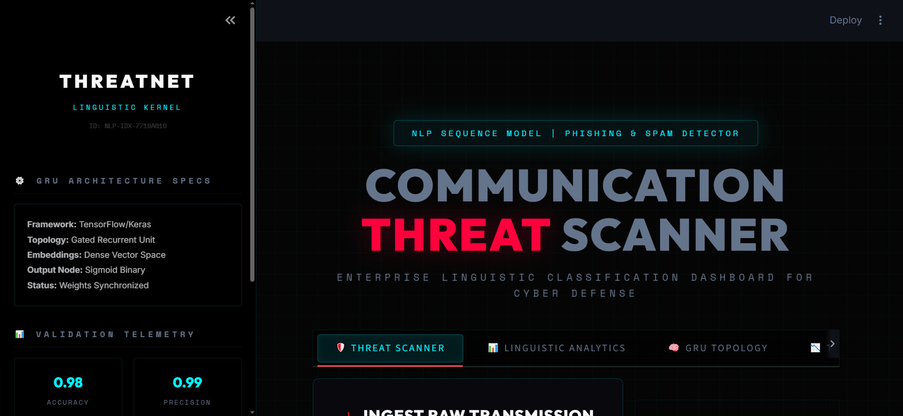
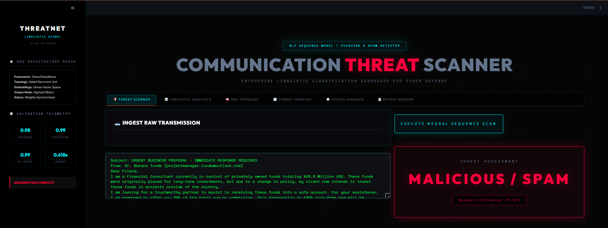
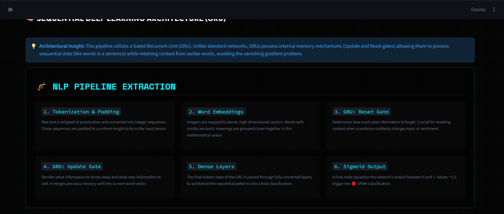

# 🛡️ Email Spam Detection (ThreatNet NLP Engine)

Deployment Link :- https://dqb6xwr2idozql2boyjf9f.streamlit.app/

Dataset Lik :- https://drive.google.com/file/d/1OkRvr3Ers5LuzmLlMorvZ8xGJmtt9r3U/view?usp=drive_link

#UI

## 📌 Project Overview
**ThreatNet** is an enterprise-grade Natural Language Processing (NLP) dashboard designed for automated cyber threat analysis and spam detection. Powered by a **Gated Recurrent Unit (GRU)** neural network, the system intercepts text payloads (emails, SMS, broadcasts), tokenizes the linguistic sequences, and executes a forward pass to classify the communication as either **Safe (Ham)** or **Malicious (Spam)**.

The platform features a monolithic, 6-tab OS environment complete with threat vector radar charts, longitudinal phishing campaign forecasting, and Monte Carlo payload obfuscation simulations.

## 🚀 Enterprise Features
* **🧠 Deep Sequential Architecture:** Powered by a TensorFlow/Keras GRU utilizing custom word embeddings, dynamic memory gates (Update/Reset), and a Sigmoid binary output node.
* **🕸️ Linguistic Topology Analytics:** Dynamic Plotly radar charts to visualize payload heuristics (Urgency signals, Special Character Frequency, Capitalization Density).
* **📉 Threat Forecasting:** Simulates 14-day attack volume trajectories for mutating vs. static phishing campaigns.
* **🎲 Attack Variance Engine:** Executes 1000-iteration Monte Carlo simulations to model network confidence against slight payload obfuscations (e.g., synonym swaps).
* **💾 Secure Dossier Export:** Generates downloadable JSON and CSV artifacts containing the threat assessment telemetry and raw payload data.

## 📁 Repository Structure

📦 Email-Spam-Detection

    ┣ 📜 app.py                   # Main Streamlit UI (ThreatNet Monolithic Build)
    ┣ 📜 gru_model.keras          # Trained Keras GRU Network (Deep Learning Weights)
    ┣ 📜 tokenizer.pickle         # NLP Text Vectorization Map
    ┣ 📜 config.pickle            # Sequence constraints (max_length, max_features)
    ┣ 📜 label_mapping.pickle     # Target classification map {0: 'Ham', 1: 'Spam'}
    ┣ 📜 requirements.txt         # Python dependency lockfile
    ┗ 📜 README.md                # System documentation

 🛠️ Installation & Setup

1. Clone the repository

       git clone [https://github.com/akshitgajera1013/Email-Spam-Detection.git](https://github.com/akshitgajera1013/Email-Spam-Detection.git)

       cd Email-Spam-Detection

2. Create a Virtual Environment (Recommended)

       python -m venv venv
       source venv/bin/activate  # On Windows use: venv\Scripts\activate

3. Install Dependencies

       pip install -r requirements.txt

4. Execute the Threat Scanner

       streamlit run app.py

🧪 Model Performance Metrics

     The GRU model was trained and validated on a comprehensive spam/ham corpus, achieving the following benchmark metrics:
     
     Global Accuracy: 0.98 (98%)
     
     Precision (Spam): 0.99
     
     F1-Score: 0.99
     
     Mean Confusion Matrix (Validation):
     
     True Negatives (Ham): 7,774
     
     True Positives (Spam): 8,657
     
     False Positives: 164

     False Negatives: 95
